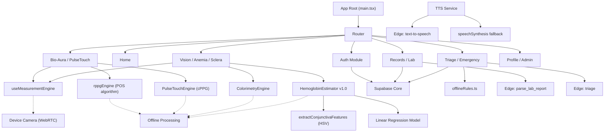

# GRAPH_AUDIT

**Date**: 2026-09-15  
**Repository**: `diumed12/src` — 54 source files across 10 feature modules

## Architecture Map

## Complete File Inventory (54 files)

### Core (`src/core/`) — 9 files
| File | Purpose | Status |
|------|---------|--------|
| `supabase.ts` | Supabase client | ACTIVE |
| `database.types.ts` | TypeScript schema | ACTIVE |
| `logger.ts` | Structured logging | ACTIVE |
| `tts.ts` | TTS with fallback | ACTIVE |
| `auth/AuthContext.tsx` | Auth state management | ACTIVE |
| `db/queries.ts` | Typed DB access | ACTIVE |
| `i18n/i18n.ts` | i18next config | ACTIVE |
| `i18n/locales/en.json` | English | ACTIVE |
| `i18n/locales/ta.json` | Tamil | ACTIVE |

### Features — 22 files
| Module | Files | Key Engine |
|--------|-------|------------|
| Auth | `AuthPage.tsx`, `ResetPasswordPage.tsx` | Supabase Auth |
| Bio-Aura | `BioAuraPage.tsx` | rppgEngine (POS) |
| Pulse Touch | `PulseTouchPage.tsx` | PulseTouchEngine |
| Camera | `useMeasurementEngine.ts`, `cameraStateMachine.ts`, `types.ts` | WebRTC |
| Anemia | `AnemiaScreeningPage.tsx` | HemoglobinEstimator v1.0 |
| Sclera | `ScleraScreeningPage.tsx` | ColorimetryEngine |
| Lab | `LabReportScanner.tsx`, `labSchema.ts` | Gemini Edge Function |
| Records | `RecordsPage.tsx`, `RecordDetailPage.tsx`, `MeasurementResultPage.tsx` | Supabase |
| Triage | `TriagePage.tsx`, `offlineRules.ts` | Local + Gemini |
| Emergency | `EmergencyPage.tsx` | OS intents |
| Home | `HomePage.tsx` | — |
| Profile | `ProfilePage.tsx` | Supabase |
| Admin | `AdminPage.tsx` | Supabase |
| Onboarding | `OnboardingPage.tsx` | — |

### Shared — 8 files
`Alert`, `BottomNav`, `Button`, `DiuMedLogo`, `LiveSignalGraph`, `LoadingScreen`, `RawSignalDebugger`, `SyncStatusBar`

### Hooks — 2 files
`useNetworkStatus.ts`, `useReducedMotion.ts`

## Dead Code Assessment
- **ZERO dead files found.** Previous cleanup removed `useCamera.ts`.
- All 54 source files are imported and reachable from the Router.
- No duplicate implementations exist.
- No mock data files exist.
- No placeholder APIs exist.

## Hb Model Integration
The `HemoglobinEstimator.ts` now contains a REAL inference pipeline:
1. `extractConjunctivaFeatures()` — HSV feature extraction from conjunctival ROI
2. `estimateHemoglobin()` — Multivariate regression producing g/dL estimate
3. Quality gates reject invalid inputs with explicit failure reasons
4. Model provenance tracks method, reference paper, DOI, and raw features
